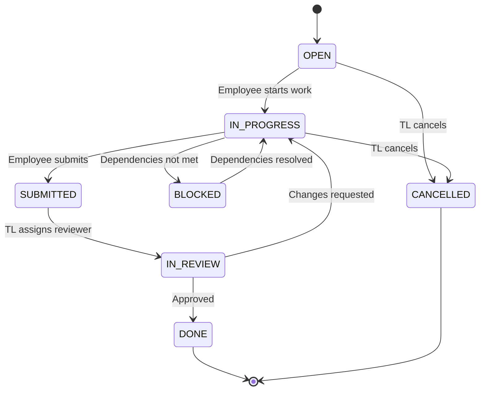
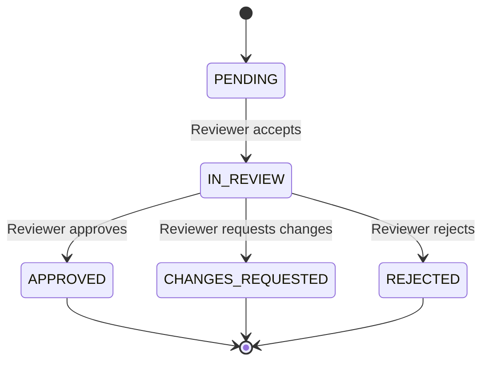

# Project Task Management System - Low Level Design (LLD)

## 📋 Overview

This repository contains the complete **Low-Level Design (LLD)** documentation for a comprehensive **Project Task Management System**. The system supports multi-role collaboration between Admins, Team Leaders, Employees, and Reviewers with full lifecycle management of projects, sprints, tasks, and reviews.

## 🎯 System Features

### Core Modules

1. **Project Management**
   - Create and manage projects
   - Add team members and assign roles
   - Track project status and progress
   - Set timelines and milestones

2. **Sprint Management**
   - Create sprints under projects
   - Define sprint duration and goals
   - Assign tasks to team members
   - Monitor sprint velocity and progress

3. **Task Management**
   - Assign tasks with priority levels (P0-P3)
   - Set task dependencies
   - Track task lifecycle: Open → In Progress → Submitted → In Review → Done
   - Set deadlines and estimates

4. **Review Management**
   - Submit work for review with attachments
   - Assign reviewers
   - Provide feedback and approval
   - Maintain review history

5. **Reporting & Analytics**
   - Project and sprint progress tracking
   - Employee performance metrics
   - Team velocity analysis
   - Export reports (PDF/Excel)

6. **Communication & Collaboration**
   - Task comments with @mentions
   - Real-time notifications
   - Activity feeds
   - Status update alerts

7. **File & Document Management**
   - Upload proof of work
   - Version control
   - Access control for files

8. **Access Control**
   - Role-based permissions (Admin, TL, Employee, Reviewer)
   - Granular access control
   - Audit logging

## 📁 Documentation Structure

```
Task Management/
├── README.md                           # This file - overview and navigation
├── task-dependency-lifecycle.md        # Task Dependency & Lifecycle (TDL) Diagram
├── class-diagram.md                    # UML Class Diagram
├── er-diagram.md                       # Entity-Relationship Diagram
└── database-schema.sql                 # Complete PostgreSQL Database Schema
```

## 📊 Diagrams

### 1. Task Dependency & Lifecycle (TDL) Diagram

**File:** [`task-dependency-lifecycle.md`](./task-dependency-lifecycle.md)

**Purpose:** Visual representation of the complete system flow showing:
- Actor interactions (Admin, TL, Employee, Reviewer)
- Module dependencies (Project → Sprint → Task → Review)
- Task lifecycle states and transitions
- Communication and notification flows
- Access control boundaries

**Technology:** Mermaid Flowchart

**Key Highlights:**
- Color-coded modules for easy identification
- Clear dependency arrows showing data flow
- Complete task state machine visualization
- Communication loops between actors

### 2. Class Diagram

**File:** [`class-diagram.md`](./class-diagram.md)

**Purpose:** Object-oriented design showing:
- All system entities with attributes and methods
- Relationships and cardinalities
- Enumerations for type safety
- Design patterns used (Composition, State Machine, Observer)

**Technology:** Mermaid Class Diagram

**Key Classes:**
- User, Team, Project, Sprint, Task
- Review, Comment, File, Notification
- Report, Analytics, ActivityLog

### 3. Entity-Relationship (ER) Diagram

**File:** [`er-diagram.md`](./er-diagram.md)

**Purpose:** Database design showing:
- All database entities and attributes
- Primary and foreign key relationships
- Cardinality and participation constraints
- Data types and constraints

**Technology:** Mermaid ER Diagram

**Key Relationships:**
- One-to-Many: User → Tasks, Project → Sprints
- Self-Referential: Comment → Comment (replies), Task Dependencies
- Many-to-Many: Users ↔ Teams, Users ↔ Projects

### 4. Database Schema

**File:** [`database-schema.sql`](./database-schema.sql)

**Purpose:** Production-ready PostgreSQL schema including:
- Complete table definitions with constraints
- All required indexes for performance
- Database triggers for automation
- Functions for business logic
- Data integrity rules

**Technology:** PostgreSQL 14+

**Key Features:**
- UUID primary keys for distributed systems
- JSONB for flexible metadata
- Automatic timestamp updates
- Circular dependency prevention
- Progress calculation triggers

## 🚀 How to Use

### Viewing Diagrams

#### Option 1: VS Code (Recommended)
1. Install the **Mermaid Preview** extension
2. Open any `.md` file with Mermaid diagrams
3. Press `Ctrl+Shift+V` (or `Cmd+Shift+V` on Mac) for preview

#### Option 2: GitHub
- Push the repository to GitHub
- GitHub natively renders Mermaid diagrams in markdown files

#### Option 3: Online Editor
- Visit [Mermaid Live Editor](https://mermaid.live)
- Copy and paste the Mermaid code from any `.md` file
- View, edit, and export as PNG/SVG

### Implementing the Database

```bash
# 1. Create PostgreSQL database
createdb project_management

# 2. Run the schema
psql -d project_management -f database-schema.sql

# 3. Verify tables
psql -d project_management -c "\dt"

# 4. Insert seed data (admin user, etc.)
psql -d project_management -c "
INSERT INTO users (email, password, first_name, last_name, role)
VALUES ('admin@example.com', 'hashed_password', 'Admin', 'User', 'ADMIN');
"
```

## 🏗️ Architecture Decisions

### 1. Database Choice: PostgreSQL
- **Why:** ACID compliance, JSONB support, strong constraint system
- **Alternatives Considered:** MySQL, MongoDB
- **Decision:** PostgreSQL's advanced features (triggers, check constraints, JSONB) fit complex business logic

### 2. UUID vs Sequential IDs
- **Why:** Better for distributed systems, no collision risk
- **Trade-off:** Slightly larger storage, no natural ordering
- **Decision:** UUID chosen for future scalability

### 3. JSONB for Metadata
- **Why:** Flexible schema for reports, analytics, and activity logs
- **Trade-off:** Less queryable than normalized tables
- **Decision:** Use JSONB only for truly dynamic data

### 4. Soft Delete vs Hard Delete
- **Why:** Audit trail, data recovery, referential integrity
- **Implementation:** `is_active` flag on users, can extend to other entities
- **Decision:** Soft delete for users, hard delete with cascades for transactional data

### 5. State Machine for Tasks
- **States:** Open → In Progress → Submitted → In Review → Done
- **Why:** Clear workflow, prevents invalid transitions
- **Implementation:** ENUM type + application-level state machine

## 🔐 Security Considerations

### 1. Authentication & Authorization
- Password hashing (bcrypt/argon2)
- JWT/Session-based authentication
- Role-based access control (RBAC)

### 2. Data Protection
- Sensitive data encryption at rest
- SQL injection prevention (parameterized queries)
- Input validation and sanitization

### 3. Audit Logging
- All critical actions logged in `activity_logs`
- Timestamp tracking on all entities
- User action attribution

## 📈 Scalability Considerations

### 1. Database Optimization
- Comprehensive indexing strategy
- Query optimization using EXPLAIN ANALYZE
- Connection pooling (e.g., PgBouncer)

### 2. Horizontal Scaling
- UUID primary keys enable sharding
- Stateless application design
- Read replicas for analytics queries

### 3. Caching Strategy
- Redis for session storage
- Cache frequently accessed data (user profiles, project lists)
- Invalidation strategy for data consistency

### 4. Performance Monitoring
- Slow query logging
- Database metrics (connection pool, query time)
- Application Performance Monitoring (APM)

## 🧪 Testing Strategy

### 1. Unit Tests
- Business logic in service layer
- Validation functions
- State transition logic

### 2. Integration Tests
- Database operations (CRUD)
- Trigger and function execution
- Constraint validation

### 3. End-to-End Tests
- Complete user workflows
- Multi-user scenarios
- Permission boundaries

## 📝 API Design Recommendations

### RESTful Endpoints

```
# Projects
GET    /api/projects                  # List all projects
POST   /api/projects                  # Create project
GET    /api/projects/:id              # Get project details
PUT    /api/projects/:id              # Update project
DELETE /api/projects/:id              # Delete project

# Sprints
GET    /api/projects/:id/sprints      # List project sprints
POST   /api/projects/:id/sprints      # Create sprint
PUT    /api/sprints/:id               # Update sprint
DELETE /api/sprints/:id               # Delete sprint

# Tasks
GET    /api/tasks                     # List tasks (with filters)
POST   /api/tasks                     # Create task
GET    /api/tasks/:id                 # Get task details
PUT    /api/tasks/:id                 # Update task
DELETE /api/tasks/:id                 # Delete task
POST   /api/tasks/:id/dependencies    # Add dependency
PUT    /api/tasks/:id/status          # Change status

# Reviews
POST   /api/tasks/:id/submit          # Submit for review
POST   /api/reviews/:id/assign        # Assign reviewer
POST   /api/reviews/:id/approve       # Approve review
POST   /api/reviews/:id/request-changes  # Request changes

# Comments
GET    /api/tasks/:id/comments        # List comments
POST   /api/tasks/:id/comments        # Add comment
PUT    /api/comments/:id              # Update comment
DELETE /api/comments/:id              # Delete comment

# Analytics
GET    /api/analytics/projects/:id    # Project analytics
GET    /api/analytics/sprints/:id     # Sprint analytics
GET    /api/analytics/users/:id       # User performance
POST   /api/reports                   # Generate report
```

## 🔄 State Transitions

### Task Lifecycle



### Review Status Flow



## 👥 Role-Based Permissions

| Action | Admin | Team Leader | Employee | Reviewer |
|--------|-------|-------------|----------|----------|
| Create Project | ✅ | ✅ | ❌ | ❌ |
| Create Sprint | ✅ | ✅ | ❌ | ❌ |
| Create Task | ✅ | ✅ | ❌ | ❌ |
| Assign Task | ✅ | ✅ | ❌ | ❌ |
| Update Own Task | ✅ | ✅ | ✅ | ❌ |
| Submit Task | ✅ | ✅ | ✅ | ❌ |
| Assign Reviewer | ✅ | ✅ | ❌ | ❌ |
| Review Task | ✅ | ✅ | ❌ | ✅ |
| Add Comment | ✅ | ✅ | ✅ | ✅ |
| View Reports | ✅ | ✅ | Own Only | ❌ |
| Manage Users | ✅ | ❌ | ❌ | ❌ |

## 📚 Additional Resources

### Technology Stack Recommendations

**Backend:**
- Node.js + Express / Python + FastAPI / Java + Spring Boot
- TypeScript for type safety
- JWT for authentication

**Database:**
- PostgreSQL 14+ (primary)
- Redis (caching & sessions)

**Frontend:**
- React / Vue / Angular
- State management: Redux / Vuex / NgRx
- Real-time: WebSocket / Socket.io

**DevOps:**
- Docker for containerization
- Kubernetes for orchestration
- GitHub Actions / GitLab CI for CI/CD

### Libraries & Tools

**Backend:**
- ORM: Prisma / TypeORM / SQLAlchemy
- Validation: Joi / Yup / Pydantic
- Testing: Jest / Pytest
- Documentation: Swagger / OpenAPI

**Monitoring:**
- Logging: Winston / Python logging
- APM: New Relic / Datadog
- Error tracking: Sentry

## 🤝 Contributing

This is a design document. For implementation:
1. Follow the class diagram for object structure
2. Use the database schema as-is or adapt for your database
3. Implement state machines for task/review lifecycle
4. Add comprehensive logging using activity_logs
5. Write tests for all business logic

## 📄 License

This design document is provided as-is for educational and implementation purposes.

## 🔗 Navigation

- **Overview:** You are here (README.md)
- **TDL Diagram:** [task-dependency-lifecycle.md](./task-dependency-lifecycle.md)
- **Class Diagram:** [class-diagram.md](./class-diagram.md)
- **ER Diagram:** [er-diagram.md](./er-diagram.md)
- **Database Schema:** [database-schema.sql](./database-schema.sql)

---

**Created:** November 5, 2025  
**Version:** 1.0  
**Status:** Complete LLD Documentation
